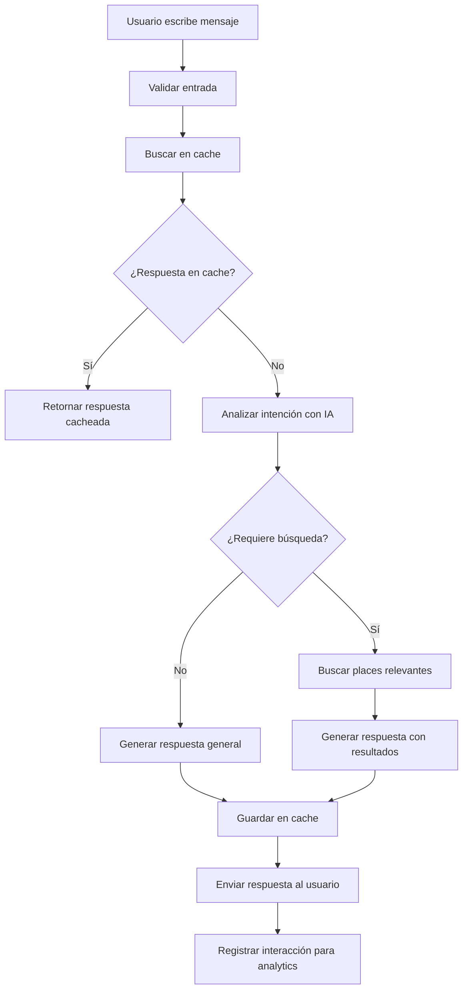
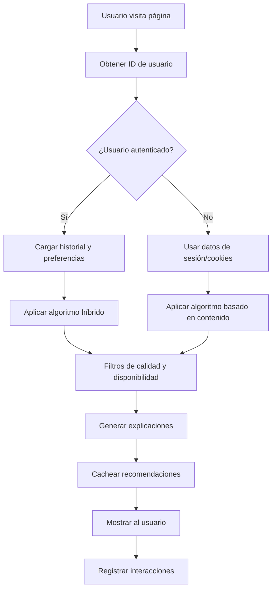
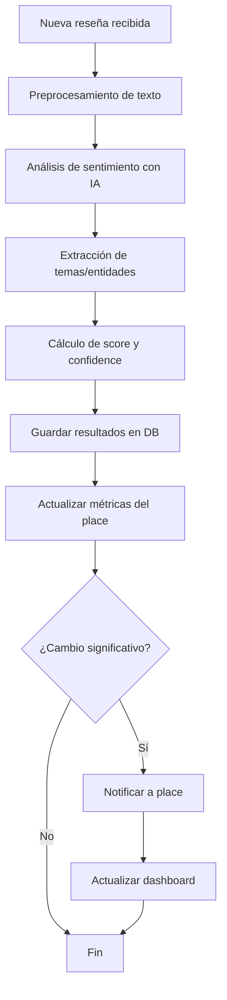

# AI Instructions - Artificial Intelligence for Directorio Concón

## 📋 Overview

Detailed instructions for incorporating **Artificial Intelligence** functionalities into the Concón Business Directory, including virtual assistant, recommendation system, sentiment analysis, semantic search, and intelligent analytics.

**Version**: 1.0  
**Status**: Planning - Phase 5 of roadmap  
**Priority**: High (significant UX improvement)

## 🌐 Language Guidelines

**Important**: All documentation and instructions are written in **English** for optimal LLM model comprehension. However, all code functions, methods, classes, and comments must be written in **Spanish** to maintain consistency with the existing codebase.

### Code Comment Standards
```typescript
// ✅ Correct - Spanish comments
/**
 * Busca places similares usando búsqueda semántica
 * @param query - Consulta de búsqueda del usuario
 * @param limit - Número máximo de resultados
 * @returns Promise con array de places similares
 */
async function buscarPlacesSimilares(query: string, limit: number = 10): Promise<Place[]> {
  // Generar embedding para la consulta
  const embedding = await this.generarEmbedding(query);
  
  // Buscar vectores similares en Qdrant
  const resultados = await this.qdrantService.buscarSimilares(embedding, limit);
  
  return resultados;
}

// ❌ Incorrect - English comments
/**
 * Search for similar companies using semantic search
 * @param query - User search query
 * @param limit - Maximum number of results
 */
```

---

## 🎯 AI Vision

### Main Objective
Transform the Concón Directory into an **intelligent** platform that:
- Understands real user needs
- Offers personalized and contextual recommendations
- Provides valuable insights to businesses
- Continuously improves based on data and feedback

### AI Principles
1. **User-centered**: AI must solve real problems
2. **Transparent**: Users should understand how it works
3. **Privacy first**: Total respect for personal data
4. **Continuous improvement**: Constant learning from patterns and behaviors
5. **Accessible**: Simple and intuitive functionalities

---

## 🤖 Main AI Features

### 1. 🗣️ Virtual Search Assistant (Intelligent ChatBot)

#### Description
Advanced chatbot that understands natural language queries and helps users find exactly what they're looking for in Concón.

#### Use Cases
```
Usuario: "Busco un lugar romántico para cenar esta noche"
IA: "Te sugiero estos 3 restaurantes románticos con disponibilidad:
    🌅 La Terraza del Mar - Vista al océano, ambiente íntimo
    🕯️ Casa Ventura - Cena a la luz de velas, cocina mediterránea  
    🌹 El Mirador - Terraza privada, perfecta para parejas"

Usuario: "Necesito un mecánico cerca del centro que trabaje sábados"
IA: "Encontré 2 talleres mecánicos en el centro que atienden sábados:
    🔧 Taller González - Especialista en japoneses, abierto hasta 18:00
    ⚙️ Automotriz Central - Servicio completo, turnos online disponibles"
```

#### Tecnología
- **LLM**: OpenAI GPT-4 o Anthropic Claude
- **Embedding**: Para búsqueda semántica en base de datos
- **Context Management**: Mantener contexto de conversación
- **Integration**: API REST desde frontend Angular

### 2. 💡 Sistema de Recomendaciones Personalizadas

#### Descripción
Engine de recomendaciones que aprende de los patrones de búsqueda y comportamiento del usuario para sugerir places relevantes.

#### Tipos de Recomendaciones
- **Basadas en ubicación**: "Cerca de ti", "En tu ruta"
- **Basadas en historial**: "Te gustaron restaurantes similares"
- **Basadas en tiempo**: "Para esta época del año", "Para este momento del día"
- **Basadas en contexto**: "Otros usuarios también buscaron"
- **Basadas en preferencias**: Categorías favoritas, rangos de precio

#### Algoritmos
```typescript
interface RecommendationEngine {
  // Filtrado colaborativo
  collaborativeFiltering(userId: string): Promise<Place[]>;
  
  // Basado en contenido
  contentBasedFiltering(place: Place): Promise<Place[]>;
  
  // Híbrido (combinación de ambos)
  hybridRecommendations(userId: string, context: RecommendationContext): Promise<RecommendationResult>;
  
  // Tendencias y popularidad
  trendingRecommendations(timeframe: 'day' | 'week' | 'month'): Promise<Place[]>;
}
```

### 3. 📊 Análisis de Sentimientos y Reviews Inteligentes

#### Descripción
Procesamiento automático de reseñas y comentarios para extraer insights sobre la calidad del servicio, aspectos positivos/negativos, y tendencias.

#### Funcionalidades
- **Análisis de sentimiento**: Positivo, neutral, negativo con confidence score
- **Extracción de temas**: Qué aspectos mencionan más (comida, servicio, ambiente)
- **Resumen automático**: "Este place destaca por su excelente atención al cliente"
- **Alertas para places**: Notificaciones sobre cambios en sentiment

#### Pipeline de Procesamiento
```typescript
interface SentimentAnalysis {
  analyzeSentiment(text: string): Promise<{
    sentiment: 'positive' | 'neutral' | 'negative';
    confidence: number;
    emotions: string[];
    topics: string[];
  }>;
  
  generateSummary(reviews: Review[]): Promise<{
    overallSentiment: number; // -1 to 1
    keyStrengths: string[];
    areasForImprovement: string[];
    summary: string;
  }>;
}
```

### 4. 🔍 Búsqueda Semántica Avanzada

#### Descripción
Sistema de búsqueda que entiende la intención y contexto del usuario, no solo keywords exactas.

#### Capacidades
- **Búsqueda por intención**: "lugar para trabajar" → cafés con WiFi
- **Búsqueda temporal**: "almuerzo rápido" → lugares con servicio express
- **Búsqueda contextual**: "cumpleaños infantil" → lugares family-friendly
- **Búsqueda multimodal**: Combinación de texto, filtros y ubicación

#### Implementación
```typescript
interface SemanticSearch {
  search(query: string, context: SearchContext): Promise<{
    results: PlaceSearchResult[];
    interpretation: string; // "Busco interpretar que necesitas..."
    suggestions: string[]; // Búsquedas relacionadas
    confidence: number;
  }>;
  
  // Generar embeddings para places
  generateEmbeddings(place: Place): Promise<number[]>;
  
  // Búsqueda por similaridad
  findSimilar(embedding: number[], limit: number): Promise<Place[]>;
}
```

### 5. 📈 Insights y Analytics Inteligentes para Places

#### Descripción
Dashboard con insights automáticos que ayudan a los places a entender su performance y mejorar su presencia.

#### Insights Disponibles
- **Análisis de tráfico**: Picos de búsqueda, horarios populares
- **Comparación competitiva**: Cómo se compara con places similares
- **Análisis de conversión**: Búsquedas → vistas → contactos
- **Sugerencias de optimización**: "Actualiza tu horario para aparecer más"
- **Predicciones**: "Se espera 30% más tráfico el próximo fin de semana"

#### Métricas Inteligentes
```typescript
interface BusinessInsights {
  generateInsights(placeId: string): Promise<{
    trafficAnalysis: TrafficInsight[];
    competitorAnalysis: CompetitorInsight;
    optimizationSuggestions: OptimizationSuggestion[];
    predictions: Prediction[];
    overallScore: number; // 0-100
  }>;
  
  // Comparar con competidores
  competitorAnalysis(placeId: string): Promise<CompetitorComparison>;
  
  // Sugerencias automáticas
  generateOptimizationTips(place: Place): Promise<OptimizationTip[]>;
}
```

---

## 🏗️ Arquitectura Técnica

### Stack Tecnológico de IA

#### AI APIs
- **OpenAI GPT-4**: For chatbot and natural language processing
- **OpenAI Embeddings**: For semantic search (text-embedding-3-small)
- **Anthropic Claude**: Alternative/backup for text processing
- **Google Cloud AI**: For sentiment analysis (optional)

#### Vector Database
- **Qdrant**: Primary vector database for storing and searching embeddings
- **Alternative**: Supabase Vector + pgvector (more economical)
- **Firestore**: For metadata and AI results

#### Caching and Performance
- **Redis**: Cache for frequent chatbot responses
- **CDN**: For static recommendation responses

### Módulos Backend (NestJS)

```
src/
├── modules/
│   ├── ai/
│   │   ├── ai.module.ts
│   │   ├── ai.controller.ts
│   │   ├── services/
│   │   │   ├── chatbot.service.ts
│   │   │   ├── recommendations.service.ts
│   │   │   ├── sentiment.service.ts
│   │   │   ├── semantic-search.service.ts
│   │   │   └── insights.service.ts
│   │   ├── dto/
│   │   │   ├── chat-message.dto.ts
│   │   │   ├── recommendation-request.dto.ts
│   │   │   └── search-query.dto.ts
│   │   ├── entities/
│   │   │   ├── chat-session.entity.ts
│   │   │   ├── user-preference.entity.ts
│   │   │   └── search-embedding.entity.ts
│   │   └── jobs/
│   │       ├── embedding-sync.job.ts
│   │       └── insights-calculation.job.ts
│   ├── analytics/
│   │   ├── analytics.module.ts
│   │   ├── analytics.service.ts
│   │   └── dto/
│   │       └── tracking-event.dto.ts
│   └── notifications/
│       ├── notifications.module.ts
│       └── ai-notifications.service.ts
```

### Componentes Frontend (Angular)

```
src/app/features/
├── ai/
│   ├── chatbot/
│   │   ├── chatbot.component.ts
│   │   ├── chatbot.component.html
│   │   ├── chatbot.service.ts
│   │   └── chat-message/
│   │       ├── chat-message.component.ts
│   │       └── chat-message.component.html
│   ├── recommendations/
│   │   ├── recommendations.component.ts
│   │   ├── recommendations.service.ts
│   │   └── recommendation-card/
│   │       ├── recommendation-card.component.ts
│   │       └── recommendation-card.component.html
│   ├── smart-search/
│   │   ├── smart-search.component.ts
│   │   ├── smart-search.service.ts
│   │   └── search-suggestions/
│   │       ├── search-suggestions.component.ts
│   │       └── search-suggestions.component.html
│   └── insights/
│       ├── business-insights/
│       │   ├── business-insights.component.ts
│       │   └── insight-card/
│       │       ├── insight-card.component.ts
│       │       └── insight-card.component.html
│       └── sentiment-analysis/
│           ├── sentiment-display.component.ts
│           └── sentiment-display.component.html
```

---

## 🔌 Integraciones y APIs

### 1. OpenAI Integration

**Configuración Backend**:
```typescript
// config/openai.config.ts
import { Injectable } from '@nestjs/common';
import { ConfigService } from '@nestjs/config';
import OpenAI from 'openai';

@Injectable()
export class OpenAIService {
  private openai: OpenAI;

  constructor(private configService: ConfigService) {
    this.openai = new OpenAI({
      apiKey: this.configService.get<string>('OPENAI_API_KEY'),
    });
  }

  async chatCompletion(messages: OpenAI.Chat.ChatCompletionMessage[]) {
    return await this.openai.chat.completions.create({
      model: 'gpt-4',
      messages,
      temperature: 0.7,
      max_tokens: 500,
    });
  }

  async generateEmbedding(text: string) {
    const response = await this.openai.embeddings.create({
      model: 'text-embedding-3-small',
      input: text,
    });
    return response.data[0].embedding;
  }
}
```

### 2. Qdrant Vector Database

**Setup**:
```typescript
// config/qdrant.config.ts
import { QdrantClient } from '@qdrant/js-client-rest';

@Injectable()
export class QdrantService {
  private client: QdrantClient;
  private readonly collectionName = 'directorio-places';

  constructor(private configService: ConfigService) {
    this.client = new QdrantClient({
      url: this.configService.get<string>('QDRANT_URL'),
      apiKey: this.configService.get<string>('QDRANT_API_KEY'),
    });
    
    // Inicializar colección si no existe
    this.inicializarColeccion();
  }

  /**
   * Inicializa la colección de vectores si no existe
   */
  private async inicializarColeccion() {
    try {
      await this.client.getCollection(this.collectionName);
    } catch (error) {
      // Crear colección si no existe
      await this.client.createCollection(this.collectionName, {
        vectors: {
          size: 1536, // OpenAI embedding dimension
          distance: 'Cosine',
        },
      });
    }
  }

  /**
   * Inserta o actualiza un vector en la base de datos
   * @param id - ID único del vector
   * @param embedding - Vector de embeddings
   * @param metadata - Metadatos asociados
   */
  async insertarVector(id: string, embedding: number[], metadata: any) {
    return await this.client.upsert(this.collectionName, {
      wait: true,
      points: [
        {
          id: id,
          vector: embedding,
          payload: metadata,
        },
      ],
    });
  }

  /**
   * Busca vectores similares
   * @param embedding - Vector de consulta
   * @param limit - Número máximo de resultados
   * @param filtro - Filtros adicionales
   */
  async buscarSimilares(embedding: number[], limit: number = 10, filtro?: any) {
    return await this.client.search(this.collectionName, {
      vector: embedding,
      limit,
      with_payload: true,
      filter: filtro,
    });
  }

  /**
   * Elimina un vector por ID
   * @param id - ID del vector a eliminar
   */
  async eliminarVector(id: string) {
    return await this.client.delete(this.collectionName, {
      wait: true,
      points: [id],
    });
  }

  /**
   * Obtiene estadísticas de la colección
   */
  async obtenerEstadisticas() {
    return await this.client.getCollection(this.collectionName);
  }
}
```

### 3. Redis Caching

**Implementación**:
```typescript
// services/ai-cache.service.ts
@Injectable()
export class AICacheService {
  constructor(@Inject('REDIS_CLIENT') private redis: Redis) {}

  async getChatResponse(query: string): Promise<string | null> {
    const cacheKey = `chat:${this.hashQuery(query)}`;
    return await this.redis.get(cacheKey);
  }

  async setChatResponse(query: string, response: string, ttl = 3600) {
    const cacheKey = `chat:${this.hashQuery(query)}`;
    await this.redis.setex(cacheKey, ttl, response);
  }

  async getRecommendations(userId: string): Promise<Place[] | null> {
    const cacheKey = `recommendations:${userId}`;
    const cached = await this.redis.get(cacheKey);
    return cached ? JSON.parse(cached) : null;
  }

  private hashQuery(query: string): string {
    return crypto.createHash('sha256').update(query.toLowerCase()).digest('hex');
  }
}
```

---

## 🎨 Experiencia de Usuario (UX)

### 1. Chatbot Widget

**Ubicación**: Botón flotante en esquina inferior derecha  
**Trigger**: Aparecer después de 30 segundos o al hacer scroll 50%  
**Estado**: Minimizado por defecto

**Interfaz**:
```html
<!-- chatbot.component.html -->
<div class="fixed bottom-6 right-6 z-50">
  <!-- Botón flotante -->
  <button 
    *ngIf="!isOpen" 
    (click)="toggleChat()"
    class="bg-primary-500 hover:bg-primary-600 text-white p-4 rounded-full shadow-lg transform hover:scale-105 transition-all duration-200">
    <svg class="w-6 h-6" fill="none" stroke="currentColor" viewBox="0 0 24 24">
      <path stroke-linecap="round" stroke-linejoin="round" stroke-width="2" d="M8 12h.01M12 12h.01M16 12h.01M21 12c0 4.418-4.03 8-9 8a9.863 9.863 0 01-4.255-.949L3 20l1.395-3.72C3.512 15.042 3 13.574 3 12c0-4.418 4.03-8 9-8s9 3.582 9 8z"></path>
    </svg>
    <span class="sr-only">Abrir asistente virtual</span>
  </button>

  <!-- Chat window -->
  <div 
    *ngIf="isOpen" 
    class="bg-white rounded-lg shadow-xl w-80 h-96 flex flex-col animate-in slide-in-from-bottom-2">
    
    <!-- Header -->
    <div class="bg-primary-500 text-white p-4 rounded-t-lg flex justify-between items-center">
      <div class="flex items-center space-x-2">
        <div class="w-2 h-2 bg-green-400 rounded-full animate-pulse"></div>
        <span class="font-semibold">Asistente Concón</span>
      </div>
      <button (click)="toggleChat()" class="text-white hover:text-gray-200">
        <svg class="w-5 h-5" fill="none" stroke="currentColor" viewBox="0 0 24 24">
          <path stroke-linecap="round" stroke-linejoin="round" stroke-width="2" d="M6 18L18 6M6 6l12 12"></path>
        </svg>
      </button>
    </div>

    <!-- Messages -->
    <div class="flex-1 p-4 overflow-y-auto space-y-4" #messagesContainer>
      <div 
        *ngFor="let message of messages$ | async; trackBy: trackMessage" 
        [ngClass]="{
          'justify-end': message.isUser,
          'justify-start': !message.isUser
        }"
        class="flex">
        
        <div 
          [ngClass]="{
            'bg-primary-500 text-white': message.isUser,
            'bg-gray-100 text-gray-800': !message.isUser
          }"
          class="max-w-xs px-4 py-2 rounded-lg">
          
          <p class="text-sm">{{ message.content }}</p>
          
          <!-- Suggestions (solo para mensajes del bot) -->
          <div *ngIf="!message.isUser && message.suggestions?.length" class="mt-2 space-y-1">
            <button 
              *ngFor="let suggestion of message.suggestions"
              (click)="sendMessage(suggestion)"
              class="block w-full text-left text-xs bg-white/20 hover:bg-white/30 px-2 py-1 rounded transition-colors">
              {{ suggestion }}
            </button>
          </div>
          
          <span class="text-xs opacity-75 mt-1 block">
            {{ message.timestamp | date:'short' }}
          </span>
        </div>
      </div>

      <!-- Typing indicator -->
      <div *ngIf="isTyping" class="flex justify-start">
        <div class="bg-gray-100 px-4 py-2 rounded-lg">
          <div class="flex space-x-1">
            <div class="w-2 h-2 bg-gray-400 rounded-full animate-bounce"></div>
            <div class="w-2 h-2 bg-gray-400 rounded-full animate-bounce animation-delay-100"></div>
            <div class="w-2 h-2 bg-gray-400 rounded-full animate-bounce animation-delay-200"></div>
          </div>
        </div>
      </div>
    </div>

    <!-- Input -->
    <div class="p-4 border-t">
      <form (ngSubmit)="sendMessage(currentMessage)" class="flex space-x-2">
        <input
          [(ngModel)]="currentMessage"
          name="message"
          type="text"
          placeholder="¿En qué te puedo ayudar?"
          class="flex-1 px-3 py-2 border border-gray-300 rounded-lg focus:outline-none focus:ring-2 focus:ring-primary-500 focus:border-transparent"
          [disabled]="isTyping">
        
        <button
          type="submit"
          [disabled]="!currentMessage.trim() || isTyping"
          class="bg-primary-500 hover:bg-primary-600 disabled:bg-gray-300 text-white px-4 py-2 rounded-lg transition-colors">
          <svg class="w-4 h-4" fill="none" stroke="currentColor" viewBox="0 0 24 24">
            <path stroke-linecap="round" stroke-linejoin="round" stroke-width="2" d="M12 19l9 2-9-18-9 18 9-2zm0 0v-8"></path>
          </svg>
        </button>
      </form>
      
      <!-- Quick actions -->
      <div class="flex flex-wrap gap-1 mt-2">
        <button 
          *ngFor="let quickAction of quickActions"
          (click)="sendMessage(quickAction)"
          class="text-xs bg-gray-100 hover:bg-gray-200 px-2 py-1 rounded transition-colors">
          {{ quickAction }}
        </button>
      </div>
    </div>
  </div>
</div>
```

### 2. Recomendaciones Inteligentes

**Ubicación**: Sección dedicada en home, resultados de búsqueda  
**Presentación**: Cards con explicación del por qué se recomienda

```html
<!-- recommendations.component.html -->
<section class="py-16 px-4 bg-gradient-to-b from-neutral-50 to-white">
  <div class="container mx-auto max-w-6xl">
    <!-- Header con personalización -->
    <div class="text-center mb-12">
      <h2 class="text-4xl font-display font-bold text-neutral-900 mb-4">
        Recomendado para ti
      </h2>
      <p class="text-lg text-neutral-600 max-w-2xl mx-auto">
        Basado en tus búsquedas anteriores y preferencias
      </p>
    </div>

    <!-- Recommendations grid -->
    <div class="grid grid-cols-1 md:grid-cols-2 lg:grid-cols-3 gap-6">
      <div 
        *ngFor="let recommendation of recommendations$ | async; trackBy: trackRecommendation"
        class="group relative">
        
        <!-- Standard place card -->
        <app-place-card [place]="recommendation.place"></app-place-card>
        
        <!-- AI Badge -->
        <div class="absolute top-3 left-3 bg-gradient-to-r from-purple-500 to-pink-500 text-white text-xs px-2 py-1 rounded-full flex items-center space-x-1">
          <svg class="w-3 h-3" fill="currentColor" viewBox="0 0 20 20">
            <path d="M9.049 2.927c.3-.921 1.603-.921 1.902 0l1.07 3.292a1 1 0 00.95.69h3.462c.969 0 1.371 1.24.588 1.81l-2.8 2.034a1 1 0 00-.364 1.118l1.07 3.292c.3.921-.755 1.688-1.54 1.118l-2.8-2.034a1 1 0 00-1.175 0l-2.8 2.034c-.784.57-1.838-.197-1.539-1.118l1.07-3.292a1 1 0 00-.364-1.118L2.98 8.72c-.783-.57-.38-1.81.588-1.81h3.461a1 1 0 00.951-.69l1.07-3.292z"></path>
          </svg>
          <span>IA</span>
        </div>
        
        <!-- Recommendation reason -->
        <div class="mt-3 bg-blue-50 border border-blue-200 rounded-lg p-3">
          <div class="flex items-start space-x-2">
            <svg class="w-4 h-4 text-blue-500 mt-0.5 flex-shrink-0" fill="currentColor" viewBox="0 0 20 20">
              <path fill-rule="evenodd" d="M18 10a8 8 0 11-16 0 8 8 0 0116 0zm-7-4a1 1 0 11-2 0 1 1 0 012 0zM9 9a1 1 0 000 2v3a1 1 0 001 1h1a1 1 0 100-2v-3a1 1 0 00-1-1H9z" clip-rule="evenodd"></path>
            </svg>
            <div>
              <p class="text-sm font-medium text-blue-800 mb-1">¿Por qué te lo recomendamos?</p>
              <p class="text-xs text-blue-600">{{ recommendation.reason }}</p>
            </div>
          </div>
        </div>
      </div>
    </div>

    <!-- Load more -->
    <div class="text-center mt-10">
      <button 
        (click)="loadMoreRecommendations()"
        [disabled]="loading"
        class="btn-primary">
        <span *ngIf="!loading">Ver más recomendaciones</span>
        <span *ngIf="loading" class="flex items-center space-x-2">
          <svg class="animate-spin w-4 h-4" fill="none" viewBox="0 0 24 24">
            <circle class="opacity-25" cx="12" cy="12" r="10" stroke="currentColor" stroke-width="4"></circle>
            <path class="opacity-75" fill="currentColor" d="m4 12a8 8 0 018-8V0C5.373 0 0 5.373 0 12h4zm2 5.291A7.962 7.962 0 014 12H0c0 3.042 1.135 5.824 3 7.938l3-2.647z"></path>
          </svg>
          <span>Cargando...</span>
        </span>
      </button>
    </div>
  </div>
</section>
```

### 3. Smart Search Bar

**Mejoras al buscador existente con IA**:

```html
<!-- smart-search.component.html -->
<div class="relative max-w-2xl mx-auto">
  <!-- Search input with AI enhancement -->
  <div class="relative">
    <input
      [(ngModel)]="searchQuery"
      (input)="onSearchInput($event)"
      (focus)="showSuggestions = true"
      type="text"
      placeholder="Busca restaurantes, servicios o pregúntame algo específico..."
      class="w-full px-6 py-4 pr-24 text-lg border-2 border-gray-200 rounded-xl focus:outline-none focus:border-primary-500 focus:ring-2 focus:ring-primary-200 transition-all shadow-lg">
    
    <!-- AI indicator -->
    <div class="absolute right-16 top-1/2 transform -translate-y-1/2">
      <div 
        *ngIf="isAIProcessing"
        class="flex items-center space-x-1 text-purple-500">
        <svg class="w-4 h-4 animate-spin" fill="none" viewBox="0 0 24 24">
          <circle class="opacity-25" cx="12" cy="12" r="10" stroke="currentColor" stroke-width="4"></circle>
          <path class="opacity-75" fill="currentColor" d="m4 12a8 8 0 018-8V0C5.373 0 0 5.373 0 12h4zm2 5.291A7.962 7.962 0 014 12H0c0 3.042 1.135 5.824 3 7.938l3-2.647z"></path>
        </svg>
        <span class="text-xs">IA</span>
      </div>
      
      <div 
        *ngIf="!isAIProcessing && searchQuery"
        class="text-purple-500">
        <svg class="w-4 h-4" fill="currentColor" viewBox="0 0 20 20">
          <path d="M9.049 2.927c.3-.921 1.603-.921 1.902 0l1.07 3.292a1 1 0 00.95.69h3.462c.969 0 1.371 1.24.588 1.81l-2.8 2.034a1 1 0 00-.364 1.118l1.07 3.292c.3.921-.755 1.688-1.54 1.118l-2.8-2.034a1 1 0 00-1.175 0l-2.8 2.034c-.784.57-1.838-.197-1.539-1.118l1.07-3.292a1 1 0 00-.364-1.118L2.98 8.72c-.783-.57-.38-1.81.588-1.81h3.461a1 1 0 00.951-.69l1.07-3.292z"></path>
        </svg>
      </div>
    </div>
    
    <!-- Search button -->
    <button
      (click)="performSearch()"
      class="absolute right-3 top-1/2 transform -translate-y-1/2 bg-primary-500 hover:bg-primary-600 text-white px-4 py-2 rounded-lg transition-colors">
      <svg class="w-5 h-5" fill="none" stroke="currentColor" viewBox="0 0 24 24">
        <path stroke-linecap="round" stroke-linejoin="round" stroke-width="2" d="m21 21l-6-6m2-5a7 7 0 11-14 0 7 7 0 0114 0z"></path>
      </svg>
    </button>
  </div>

  <!-- AI Interpretation -->
  <div 
    *ngIf="searchInterpretation && searchQuery"
    class="mt-3 p-3 bg-purple-50 border border-purple-200 rounded-lg">
    <div class="flex items-start space-x-2">
      <svg class="w-4 h-4 text-purple-500 mt-0.5" fill="currentColor" viewBox="0 0 20 20">
        <path d="M9.049 2.927c.3-.921 1.603-.921 1.902 0l1.07 3.292a1 1 0 00.95.69h3.462c.969 0 1.371 1.24.588 1.81l-2.8 2.034a1 1 0 00-.364 1.118l1.07 3.292c.3.921-.755 1.688-1.54 1.118l-2.8-2.034a1 1 0 00-1.175 0l-2.8 2.034c-.784.57-1.838-.197-1.539-1.118l1.07-3.292a1 1 0 00-.364-1.118L2.98 8.72c-.783-.57-.38-1.81.588-1.81h3.461a1 1 0 00.951-.69l1.07-3.292z"></path>
      </svg>
      <div>
        <p class="text-sm text-purple-800">
          <span class="font-medium">Entiendo que buscas:</span> {{ searchInterpretation }}
        </p>
      </div>
    </div>
  </div>

  <!-- Smart suggestions dropdown -->
  <div 
    *ngIf="showSuggestions && (smartSuggestions?.length || searchHistory?.length)"
    class="absolute top-full left-0 right-0 mt-2 bg-white border border-gray-200 rounded-xl shadow-xl z-50 max-h-96 overflow-y-auto">
    
    <!-- AI-powered suggestions -->
    <div *ngIf="smartSuggestions?.length" class="p-4 border-b border-gray-100">
      <h4 class="text-sm font-semibold text-purple-600 mb-2 flex items-center space-x-2">
        <svg class="w-4 h-4" fill="currentColor" viewBox="0 0 20 20">
          <path d="M9.049 2.927c.3-.921 1.603-.921 1.902 0l1.07 3.292a1 1 0 00.95.69h3.462c.969 0 1.371 1.24.588 1.81l-2.8 2.034a1 1 0 00-.364 1.118l1.07 3.292c.3.921-.755 1.688-1.54 1.118l-2.8-2.034a1 1 0 00-1.175 0l-2.8 2.034c-.784.57-1.838-.197-1.539-1.118l1.07-3.292a1 1 0 00-.364-1.118L2.98 8.72c-.783-.57-.38-1.81.588-1.81h3.461a1 1 0 00.951-.69l1.07-3.292z"></path>
        </svg>
        <span>Sugerencias inteligentes</span>
      </h4>
      <div class="space-y-1">
        <button
          *ngFor="let suggestion of smartSuggestions"
          (click)="selectSuggestion(suggestion)"
          class="w-full text-left px-3 py-2 hover:bg-gray-50 rounded-lg transition-colors">
          <div class="flex items-center space-x-3">
            <div class="flex-shrink-0">
              <div class="w-2 h-2 bg-purple-400 rounded-full"></div>
            </div>
            <div>
              <p class="text-sm text-gray-800">{{ suggestion.text }}</p>
              <p class="text-xs text-gray-500">{{ suggestion.description }}</p>
            </div>
          </div>
        </button>
      </div>
    </div>

    <!-- Search history -->
    <div *ngIf="searchHistory?.length" class="p-4">
      <h4 class="text-sm font-semibold text-gray-600 mb-2 flex items-center space-x-2">
        <svg class="w-4 h-4" fill="none" stroke="currentColor" viewBox="0 0 24 24">
          <path stroke-linecap="round" stroke-linejoin="round" stroke-width="2" d="M12 8v4l3 3m6-3a9 9 0 11-18 0 9 9 0 0118 0z"></path>
        </svg>
        <span>Búsquedas recientes</span>
      </h4>
      <div class="space-y-1">
        <button
          *ngFor="let historyItem of searchHistory"
          (click)="selectSuggestion({ text: historyItem })"
          class="w-full text-left px-3 py-2 hover:bg-gray-50 rounded-lg transition-colors flex items-center space-x-3">
          <svg class="w-4 h-4 text-gray-400" fill="none" stroke="currentColor" viewBox="0 0 24 24">
            <path stroke-linecap="round" stroke-linejoin="round" stroke-width="2" d="M12 8v4l3 3m6-3a9 9 0 11-18 0 9 9 0 0118 0z"></path>
          </svg>
          <span class="text-sm text-gray-700">{{ historyItem }}</span>
        </button>
      </div>
    </div>
  </div>

  <!-- Click outside to close -->
  <div 
    *ngIf="showSuggestions"
    (click)="showSuggestions = false"
    class="fixed inset-0 z-40"></div>
</div>
```

---

## 🔄 Flujos de Trabajo de IA

### 1. Flujo del Chatbot



### 2. Flujo de Recomendaciones



### 3. Flujo de Análisis de Sentimientos



---

## 📊 Modelos de Datos para IA

### Firestore Collections para IA

#### 1. `ai-chat-sessions`
```typescript
interface ChatSession {
  id: string;
  userId?: string;           // null for anonymous users
  sessionId: string;         // UUID for tracking
  startedAt: Timestamp;
  lastMessageAt: Timestamp;
  messageCount: number;
  resolved: boolean;         // Was the query resolved?
  satisfaction?: number;     // 1-5 optional rating
  // Nuevos campos mejorados
  deviceInfo?: {
    userAgent: string;
    isMobile: boolean;
    platform: string;
  };
  location?: {               // Ubicación aproximada del usuario
    lat: number;
    lng: number;
    accuracy: number;        // metros de precisión
  };
  intent?: string;           // Intención clasificada automáticamente
  businessCategory?: string; // Categoría de places más consultada
  averageResponseTime?: number; // ms promedio de respuesta
  totalTokensUsed?: number;  // Tokens consumidos en la sesión
}
```

#### 2. `ai-chat-messages`
```typescript
interface ChatMessage {
  id: string;
  sessionId: string;
  isUser: boolean;
  content: string;
  timestamp: Timestamp;
  // Campos mejorados para el análisis
  intent?: {
    category: 'search' | 'recommendation' | 'information' | 'complaint' | 'other';
    subcategory?: string;    // e.g., 'restaurant_search', 'hotel_info'
    confidence: number;      // 0-1
  };
  entities?: {
    type: 'place' | 'categoria' | 'barrio' | 'servicio' | 'ubicacion' | 'tiempo';
    value: string;
    confidence: number;
    startIndex: number;
    endIndex: number;
  }[];
  suggestions?: string[];    // follow-up suggestions
  relatedPlaces?: {
    placeId: string;
    relevanceScore: number;  // 0-1
    reason: string;          // Why it was suggested
  }[];
  // Métricas de rendimiento
  processingTime?: number;   // ms para generar respuesta
  modelUsed?: string;        // 'gpt-4', 'claude-3', etc.
  tokensUsed?: number;       // Tokens consumidos
  wasCached?: boolean;       // Si vino del cache
  userFeedback?: {
    helpful: boolean;
    rating?: number;         // 1-5
    comment?: string;
  };
}
```

#### 3. `ai-user-preferences`
```typescript
interface UserPreferences {
  id: string;               // userId
  // Preferencias básicas
  preferredCategories: {
    categoriaId: string;
    weight: number;          // 0-1, importance weight
    lastInteraction: Timestamp;
  }[];
  preferredBarrios: {
    barrioId: string;
    weight: number;
    reasons: string[];       // 'lives_nearby', 'works_there', 'likes_area'
  }[];
  
  // Historial detallado
  searchHistory: {
    query: string;
    timestamp: Timestamp;
    resultCount: number;
    clickedResults: string[]; // place IDs clicked
    searchMethod: 'text' | 'voice' | 'chat' | 'filters';
    location?: {
      lat: number;
      lng: number;
    };
  }[];
  
  // Interacciones mejoradas
  interactions: {
    placeId: string;
    type: 'view' | 'contact' | 'recommend' | 'share' | 'favorite' | 'review';
    timestamp: Timestamp;
    duration?: number;       // time spent viewing (ms)
    source: 'search' | 'recommendation' | 'map' | 'category' | 'chat';
    rating?: number;         // if type is 'review'
  }[];
  
  // Personalización de IA
  aiPersonalization: {
    preferredResponseStyle: 'formal' | 'casual' | 'detailed' | 'brief';
    language: 'es' | 'en';
    timezone: string;
    chatPersonality: 'professional' | 'friendly' | 'enthusiastic';
    notificationPreferences: {
      newRecommendations: boolean;
      businessUpdates: boolean;
      priceAlerts: boolean;
    };
  };
  
  // Perfiles de comportamiento
  behaviorProfile: {
    isFrequentUser: boolean;
    primaryUsageTime: 'morning' | 'afternoon' | 'evening' | 'night';
    devicePreference: 'mobile' | 'desktop' | 'both';
    averageSessionDuration: number; // minutes
    searchPatterns: string[];       // detected patterns
  };
  
  // Metadata
  createdAt: Timestamp;
  lastUpdated: Timestamp;
  consentGiven: boolean;    // GDPR compliance
  dataRetentionUntil?: Timestamp;
}
```

#### 4. `ai-place-embeddings`
```typescript
interface PlaceEmbedding {
  id: string;               // placeId
  
  // Múltiples tipos de embeddings
  embeddings: {
    description: number[];   // embedding de descripción completa
    services: number[];      // embedding de servicios específicos
    reviews: number[];       // embedding basado en reseñas
    combined: number[];      // embedding combinado (usado por defecto)
  };
  
  // Metadata enriquecida
  lastUpdated: Timestamp;
  embeddingVersion: string; // versión del modelo (e.g., 'text-embedding-3-small')
  
  // Contenido fuente estructurado
  sourceContent: {
    fullDescription: string;      // descripción completa
    keyServices: string[];        // servicios principales
    specialties: string[];        // especialidades únicas
    atmosphere: string[];         // ambiente/características
    priceRange: 'budget' | 'mid' | 'premium' | 'luxury';
    targetAudience: string[];     // audiencia objetivo
  };
  
  // Características para búsqueda
  searchableFeatures: {
    categoriaId: string;
    categoriaName: string;
    barrioId: string;
    barrioName: string;
    tags: string[];              // tags manuales
    aiGeneratedTags: string[];   // tags generados por IA
    semanticKeywords: string[];  // keywords semánticas
  };
  
  // Métricas de calidad
  qualityMetrics: {
    embeddingQualityScore: number;  // 0-1, calidad del embedding
    contentCompleteness: number;    // 0-1, completitud de datos
    lastValidation: Timestamp;
    needsUpdate: boolean;
  };
  
  // Contexto temporal y geográfico
  temporalContext: {
    seasonalRelevance: string[];    // 'summer', 'winter', 'year-round'
    timeOfDayRelevance: string[];   // 'morning', 'lunch', 'dinner', 'late-night'
    weekdayRelevance: string[];     // 'weekday', 'weekend', 'any'
  };
  
  geographicalContext: {
    proximity: {
      beach: number;        // distancia a playa (metros)
      center: number;       // distancia al centro (metros)
      transportation: number; // distancia a transporte público
    };
    accessibility: string[];  // 'parking', 'wheelchair', 'public_transport'
  };
}
```

#### 5. `ai-sentiment-analysis`
```typescript
interface SentimentAnalysis {
  id: string;
  placeId: string;
  
  // Fuente del análisis
  sourceType: 'review' | 'chat_mention' | 'social_media' | 'survey' | 'aggregated';
  sourceId?: string;        // ID de la fuente específica
  
  // Análisis de sentimiento granular
  sentiment: {
    overall: 'positive' | 'neutral' | 'negative';
    score: number;          // -1 to 1
    confidence: number;     // 0-1
    magnitude: number;      // 0-1, intensity of sentiment
  };
  
  // Análisis emocional detallado
  emotions: {
    emotion: 'joy' | 'sadness' | 'anger' | 'fear' | 'surprise' | 'disgust' | 'trust' | 'anticipation';
    intensity: number;      // 0-1
    confidence: number;     // 0-1
  }[];
  
  // Análisis por aspectos
  aspectSentiments: {
    aspect: 'food' | 'service' | 'ambiance' | 'price' | 'location' | 'cleanliness' | 'speed' | 'quality';
    sentiment: number;      // -1 to 1
    mentions: number;
    keyPhrases: string[];   // frases representativas
    importance: number;     // 0-1, importance of this aspect
  }[];
  
  // Extracción de temas
  topics: {
    topic: string;
    sentiment: number;      // -1 to 1
    mentions: number;
    relatedWords: string[];
    trend: 'improving' | 'stable' | 'declining'; // trend over time
  }[];
  
  // Resúmenes generados
  summaries: {
    brief: string;          // resumen de 1 línea
    detailed: string;       // resumen detallado
    actionable: string[];   // sugerencias específicas
    strengths: string[];    // fortalezas identificadas
    improvements: string[]; // áreas de mejora
  };
  
  // Metadata y métricas
  analyzedAt: Timestamp;
  modelVersion: string;
  processingTime: number;   // ms
  tokensUsed: number;
  
  // Contexto temporal
  period: {
    start: Timestamp;
    end: Timestamp;
    sampleSize: number;     // número de reseñas/menciones analizadas
  };
  
  // Comparativas
  comparisons: {
    previousPeriod?: number;    // comparación con período anterior
    categoryAverage?: number;   // comparación con promedio de categoría
    cityAverage?: number;       // comparación con promedio de la ciudad
  };
  
  // Alertas automáticas
  alerts: {
    type: 'sudden_drop' | 'negative_trend' | 'positive_spike' | 'review_bomb';
    severity: 'low' | 'medium' | 'high' | 'critical';
    description: string;
    actionRequired: boolean;
  }[];
}
```

#### 6. `ai-business-insights`
```typescript
interface BusinessInsight {
  id: string;
  placeId: string;
  
  // Período de análisis
  period: {
    start: Timestamp;
    end: Timestamp;
    type: 'daily' | 'weekly' | 'monthly' | 'quarterly' | 'custom';
  };
  
  // Métricas base expandidas
  metrics: {
    // Tráfico y engagement
    totalViews: number;
    uniqueVisitors: number;
    pageViews: number;
    averageSessionDuration: number;
    bounceRate: number;
    
    // Búsquedas y descubrimiento
    searchImpressions: number;
    searchClicks: number;
    clickThroughRate: number;
    averageSearchPosition: number;
    organicTraffic: number;
    
    // Interacciones
    contactRequests: number;
    phoneClicks: number;
    emailClicks: number;
    websiteClicks: number;
    directionsRequests: number;
    socialMediaClicks: number;
    
    // Recomendaciones y IA
    aiRecommendations: number;
    recommendationClicks: number;
    chatbotMentions: number;
    voiceSearches: number;
  };
  
  // Insights categorizados y estructurados
  insights: {
    // Performance insights
    performance: {
      type: 'traffic_spike' | 'traffic_drop' | 'engagement_improved' | 'conversion_optimized';
      title: string;
      description: string;
      impact: number;         // 0-100
      confidence: number;     // 0-1
      evidence: string[];     // supporting data points
      actionable: boolean;
      estimatedRevenue?: number; // if applicable
    }[];
    
    // Competitive insights
    competitive: {
      type: 'market_opportunity' | 'competitor_analysis' | 'positioning' | 'pricing';
      title: string;
      description: string;
      competitors: string[];   // place IDs
      marketShare: number;     // estimated market share
      recommendations: string[];
      priority: 'low' | 'medium' | 'high' | 'critical';
    }[];
    
    // Customer insights
    customer: {
      type: 'behavior_pattern' | 'preference_shift' | 'demographic_change' | 'satisfaction';
      title: string;
      description: string;
      segments: {
        segment: string;
        size: number;        // percentage
        behavior: string;
        value: number;       // relative value 0-1
      }[];
      trends: string[];
      actionItems: string[];
    }[];
    
    // Operational insights
    operational: {
      type: 'hours_optimization' | 'service_gaps' | 'capacity_utilization' | 'staff_needs';
      title: string;
      description: string;
      currentState: any;
      recommendedChanges: any;
      expectedImprovement: number; // percentage
      implementationDifficulty: 'easy' | 'medium' | 'hard';
    }[];
  };
  
  // Predicciones y forecasting
  predictions: {
    timeframe: '1_week' | '1_month' | '3_months' | '6_months';
    metric: string;
    currentValue: number;
    predictedValue: number;
    confidence: number;      // 0-1
    factors: string[];       // factors influencing prediction
    scenarios: {
      scenario: 'pessimistic' | 'realistic' | 'optimistic';
      probability: number;   // 0-1
      value: number;
      description: string;
    }[];
  }[];
  
  // Recomendaciones de acción
  actionRecommendations: {
    category: 'marketing' | 'operations' | 'customer_service' | 'pricing' | 'content';
    action: string;
    description: string;
    priority: 'low' | 'medium' | 'high' | 'critical';
    effort: 'low' | 'medium' | 'high';
    expectedImpact: number;  // 0-100
    timeline: string;        // "1-2 weeks", "1 month", etc.
    cost: 'free' | 'low' | 'medium' | 'high';
    resources: string[];     // required resources
  }[];
  
  // Benchmarking
  benchmarks: {
    metric: string;
    value: number;
    categoryAverage: number;
    cityAverage: number;
    topPerformer: number;
    percentile: number;      // 0-100, where this business ranks
    trend: 'improving' | 'stable' | 'declining';
  }[];
  
  // Metadata
  generatedAt: Timestamp;
  aiModel: string;
  processingTime: number;   // ms
  dataQuality: number;      // 0-1, quality of input data
  confidence: number;       // 0-1, overall confidence in insights
  
  // Estado y seguimiento
  status: 'draft' | 'ready' | 'delivered' | 'reviewed';
  viewedBy: string[];       // user IDs who viewed
  actionsImplemented: string[]; // actions that were implemented
  feedback: {
    helpful: boolean;
    rating: number;         // 1-5
    comment?: string;
    timestamp: Timestamp;
  }[];
}
```

#### 7. `ai-recommendation-models`
```typescript
interface RecommendationModel {
  id: string;
  userId: string;
  
  // Modelo de preferencias del usuario
  userProfile: {
    demographicProfile: {
      ageRange?: string;
      location?: string;
      interests: string[];
      spendingPattern: 'budget' | 'moderate' | 'premium';
    };
    
    behaviorProfile: {
      searchPatterns: string[];
      timePreferences: string[];      // 'morning', 'evening', etc.
      frequencyPattern: 'occasional' | 'regular' | 'frequent';
      deviceUsage: 'mobile' | 'desktop' | 'both';
      sessionDuration: number;        // average minutes
    };
    
    preferenceVector: number[];       // embedding representing user preferences
    categoryWeights: {
      categoriaId: string;
      weight: number;                 // 0-1
      confidence: number;             // 0-1
      lastUpdated: Timestamp;
    }[];
    
    locationBias: {
      preferredAreas: string[];       // barrio IDs
      maxDistance: number;            // meters
      transportPreference: 'walking' | 'driving' | 'public' | 'any';
    };
  };
  
  // Historial de recomendaciones
  recommendationHistory: {
    recommendationId: string;
    placeId: string;
    score: number;                    // 0-1, recommendation strength
    algorithm: 'collaborative' | 'content' | 'hybrid' | 'ai_generated';
    reason: string;                   // explanation for recommendation
    timestamp: Timestamp;
    
    // Feedback del usuario
    userAction: 'clicked' | 'ignored' | 'dismissed' | 'contacted' | 'visited';
    feedback?: {
      relevant: boolean;
      rating?: number;                // 1-5
      comment?: string;
    };
    
    // Contexto de la recomendación
    context: {
      searchQuery?: string;
      currentLocation?: { lat: number; lng: number; };
      timeOfDay: string;
      dayOfWeek: string;
      weather?: string;
    };
  }[];
  
  // Modelo de similaridad con otros usuarios
  similarUsers: {
    userId: string;
    similarity: number;               // 0-1
    commonInterests: string[];
    lastCalculated: Timestamp;
  }[];
  
  // Metadata del modelo
  modelVersion: string;
  lastTraining: Timestamp;
  accuracy: number;                   // 0-1, model accuracy
  confidence: number;                 // 0-1, confidence in recommendations
  dataPoints: number;                 // number of interactions used for training
}
```

#### 8. `ai-search-analytics`
```typescript
interface SearchAnalytics {
  id: string;
  
  // Query information
  searchQuery: string;
  normalizedQuery: string;            // cleaned and normalized
  queryVector?: number[];             // embedding of the query
  
  // User context
  userId?: string;
  sessionId: string;
  timestamp: Timestamp;
  
  // Search context
  searchContext: {
    userLocation?: { lat: number; lng: number; };
    device: 'mobile' | 'desktop' | 'tablet';
    source: 'direct' | 'chat' | 'voice' | 'suggestion';
    previousQueries: string[];        // previous queries in session
    timeOfDay: 'morning' | 'afternoon' | 'evening' | 'night';
    dayOfWeek: string;
    weather?: {
      condition: string;
      temperature: number;
    };
  };
  
  // Intent analysis
  intentAnalysis: {
    primaryIntent: 'find_business' | 'get_info' | 'compare' | 'navigate' | 'contact';
    confidence: number;               // 0-1
    entities: {
      type: 'business_type' | 'location' | 'price_range' | 'time' | 'feature';
      value: string;
      confidence: number;
    }[];
    searchComplexity: 'simple' | 'medium' | 'complex';
  };
  
  // Results and performance
  searchResults: {
    totalResults: number;
    resultsSources: {
      traditional: number;            // text-based search results
      semantic: number;               // AI semantic search results
      recommended: number;            // AI recommended results
    };
    
    topResults: {
      placeId: string;
      rank: number;
      score: number;                  // relevance score
      source: 'text' | 'semantic' | 'recommendation';
    }[];
    
    userInteractions: {
      clicked: string[];              // place IDs clicked
      contacted: string[];            // place IDs contacted
      timeSpent: number[];            // seconds on each result
      scrollDepth: number;            // how far user scrolled
    };
  };
  
  // Search quality metrics
  qualityMetrics: {
    queryClarity: number;             // 0-1, how clear was the query
    resultRelevance: number;          // 0-1, relevance of results
    userSatisfaction?: number;        // 1-5, if user provided feedback
    searchSuccess: boolean;           // did user find what they wanted
    
    // Technical metrics
    searchLatency: number;            // ms
    aiProcessingTime: number;         // ms for AI components
    cacheHitRate: number;            // 0-1
  };
  
  // Improvements and learning
  suggestions: {
    queryImprovements: string[];      // suggested better ways to search
    missingBusinessTypes: string[];   // business types we don't have
    featureRequests: string[];        // features users seem to want
  };
  
  // Follow-up actions
  followUp: {
    refinedSearches: string[];        // subsequent refined searches
    alternativeQueries: string[];     // alternative ways user searched
    finalAction: 'found' | 'gave_up' | 'contacted_support' | 'continued_browsing';
  };
}
```

#### 9. `ai-model-performance`
```typescript
interface ModelPerformance {
  id: string;
  modelType: 'chatbot' | 'recommendations' | 'search' | 'sentiment' | 'embeddings';
  modelVersion: string;
  
  // Performance period
  evaluationPeriod: {
    start: Timestamp;
    end: Timestamp;
    totalRequests: number;
    totalUsers: number;
  };
  
  // Accuracy metrics
  accuracyMetrics: {
    overallAccuracy: number;          // 0-1
    precision: number;                // 0-1
    recall: number;                   // 0-1
    f1Score: number;                  // 0-1
    
    // By category
    categoryPerformance: {
      category: string;
      accuracy: number;
      sampleSize: number;
    }[];
  };
  
  // User satisfaction
  userSatisfaction: {
    averageRating: number;            // 1-5
    totalRatings: number;
    ratingDistribution: {
      rating: number;
      count: number;
    }[];
    
    // Qualitative feedback
    positiveComments: string[];
    negativeComments: string[];
    improvementSuggestions: string[];
  };
  
  // Performance metrics
  performanceMetrics: {
    averageResponseTime: number;      // ms
    cacheHitRate: number;            // 0-1
    errorRate: number;               // 0-1
    uptime: number;                  // 0-1
    
    // Cost metrics
    totalCost: number;               // USD
    costPerRequest: number;          // USD
    tokenUsage: {
      totalTokens: number;
      averageTokensPerRequest: number;
      costPerToken: number;
    };
  };
  
  // A/B test results
  abTestResults?: {
    testName: string;
    variants: {
      name: string;
      trafficAllocation: number;      // 0-1
      conversionRate: number;         // 0-1
      userSatisfaction: number;       // 1-5
      statisticalSignificance: number; // 0-1
    }[];
    winner?: string;
    confidence: number;              // 0-1
  }[];
  
  // Improvement recommendations
  recommendations: {
    priority: 'low' | 'medium' | 'high' | 'critical';
    category: 'accuracy' | 'performance' | 'cost' | 'user_experience';
    recommendation: string;
    expectedImprovement: number;      // percentage
    implementationCost: 'low' | 'medium' | 'high';
    timeline: string;
  }[];
  
  // Trend analysis
  trends: {
    metric: string;
    direction: 'improving' | 'stable' | 'declining';
    changeRate: number;              // percentage change
    significance: 'minor' | 'moderate' | 'major';
    prediction: {
      nextPeriodValue: number;
      confidence: number;            // 0-1
    };
  }[];
  
  generatedAt: Timestamp;
  nextEvaluationScheduled: Timestamp;
}
```

### Qdrant Vector Database Schema

```typescript
interface QdrantPayload {
  placeId: string;
  nombre: string;
  categoriaId: string;
  categoriaName: string;
  barrioId: string;
  barrioName: string;
  tags: string[];
  lastUpdated: number;      // timestamp
  status: string;           // para filtrar solo places aprobadas
  coordenadas?: {
    lat: number;
    lng: number;
  };
}

// Ejemplo de uso
const vectorData = {
  id: 'place-123',
  vector: [0.1, 0.2, -0.3, ...], // 1536 dimensiones para OpenAI
  payload: {
    placeId: 'place-123',
    nombre: 'Restaurante La Perla',
    categoriaId: 'cat-restaurantes',
    categoriaName: 'Restaurantes',
    barrioId: 'barrio-centro',
    barrioName: 'Centro',
    tags: ['mariscos', 'vista-mar', 'romantico'],
    lastUpdated: Date.now(),
    status: 'aprobado',
    coordenadas: {
      lat: -32.9167,
      lng: -71.5167
    }
  }
};

// Filter examples for Qdrant
const filtroCategoria = {
  must: [
    {
      key: 'categoriaId',
      match: {
        value: 'cat-restaurantes'
      }
    },
    {
      key: 'status',
      match: {
        value: 'aprobado'
      }
    }
  ]
};
```

---

## ⚙️ Variables de Entorno para IA

### Backend (.env)

```bash
# OpenAI Configuration
OPENAI_API_KEY=sk-...
OPENAI_MODEL=gpt-4
OPENAI_EMBEDDING_MODEL=text-embedding-3-small
OPENAI_MAX_TOKENS=1000
OPENAI_TEMPERATURE=0.7
OPENAI_MAX_RETRIES=3

# Anthropic Configuration (backup)
ANTHROPIC_API_KEY=sk-ant-...
ANTHROPIC_MODEL=claude-3-sonnet-20240229
ANTHROPIC_MAX_TOKENS=1000

# Qdrant Vector Database
QDRANT_URL=http://localhost:6333
QDRANT_API_KEY=your-qdrant-api-key
QDRANT_COLLECTION_NAME=directorio-places
QDRANT_TIMEOUT=30000
QDRANT_GRPC_PORT=6334

# Redis Caching
REDIS_URL=redis://localhost:6379
REDIS_PASSWORD=your-redis-password
REDIS_TTL_CHAT=3600              # 1 hour
REDIS_TTL_RECOMMENDATIONS=1800   # 30 minutes
REDIS_TTL_EMBEDDINGS=86400       # 24 hours
REDIS_TTL_SEARCH=600             # 10 minutes

# AI Feature Flags
AI_ENABLED=true
AI_CHATBOT_ENABLED=true
AI_RECOMMENDATIONS_ENABLED=true
AI_SENTIMENT_ENABLED=true
AI_INSIGHTS_ENABLED=true
AI_SEMANTIC_SEARCH_ENABLED=true

# Rate Limiting Configuration
AI_RATE_LIMIT_PER_USER=100       # requests per hour for authenticated users
AI_RATE_LIMIT_ANONYMOUS=20       # requests per hour for anonymous users
AI_RATE_LIMIT_PREMIUM=500        # requests per hour for premium users
AI_BURST_LIMIT=10                # burst requests allowed

# Background Job Configuration
AI_EMBEDDING_SYNC_INTERVAL=3600  # sync embeddings every hour
AI_INSIGHTS_GENERATION_INTERVAL=86400  # generate insights daily
AI_MODEL_EVALUATION_INTERVAL=604800    # evaluate models weekly
AI_CLEANUP_INTERVAL=86400        # cleanup old data daily

# Cost Management
AI_DAILY_BUDGET_LIMIT=50         # USD per day
AI_MONTHLY_BUDGET_LIMIT=1000     # USD per month
AI_COST_ALERT_THRESHOLD=0.8      # alert at 80% of budget

# Quality and Performance
AI_MIN_CONFIDENCE_THRESHOLD=0.7  # minimum confidence for AI responses
AI_MAX_RESPONSE_TIME=5000        # max response time in ms
AI_EMBEDDING_BATCH_SIZE=100      # batch size for embedding generation
AI_SEARCH_RESULT_LIMIT=20        # max results for semantic search

# Monitoring and Logging
AI_LOG_LEVEL=info
AI_DETAILED_LOGGING=false
AI_PERFORMANCE_MONITORING=true
AI_ERROR_REPORTING=true
```

### Frontend (environment.ts)

```typescript
export const environment = {
  production: false,
  apiUrl: 'http://localhost:3000/api',
  
  // ... existing config
  
  // AI Features
  ai: {
    chatbotEnabled: true,
    recommendationsEnabled: true,
    smartSearchEnabled: true,
    sentimentDisplayEnabled: true,
    
    // UI Configuration
    chatbot: {
      autoOpen: false,
      openDelay: 30000,        // 30 seconds
      position: 'bottom-right',
      theme: 'default'
    },
    
    recommendations: {
      maxItems: 6,
      refreshInterval: 300000,  // 5 minutes
      showReasons: true
    },
    
    smartSearch: {
      debounceTime: 300,       // ms
      minQueryLength: 3,
      maxSuggestions: 5
    }
  }
};
```

---

## 🚀 Plan de Implementación

### Fase 1: Fundamentos (2-3 sprints)
- [ ] Setup OpenAI/Anthropic integration
- [ ] Setup Pinecone vector database
- [ ] Setup Redis caching
- [ ] Módulo AI base en backend
- [ ] Generación de embeddings para places existentes
- [ ] Testing básico de integración

### Fase 2: Chatbot Inteligente (2 sprints)
- [ ] Servicio de chatbot en backend
- [ ] Componente de chatbot en frontend
- [ ] Manejo de intenciones básicas
- [ ] Cache de respuestas frecuentes
- [ ] Integración con base de datos de places
- [ ] Testing de conversaciones

### Fase 3: Sistema de Recomendaciones (2 sprints)
- [ ] Algoritmo de recomendaciones híbrido
- [ ] Tracking de preferencias de usuario
- [ ] Componente de recomendaciones en frontend
- [ ] A/B testing de algoritmos
- [ ] Métricas de efectividad
- [ ] Optimización de performance

### Fase 4: Búsqueda Semántica (1-2 sprints)
- [ ] Integración de embeddings en búsqueda
- [ ] Mejora del componente de búsqueda
- [ ] Sugerencias inteligentes
- [ ] Interpretación de queries
- [ ] Testing de relevancia

### Fase 5: Análisis de Sentimientos (1-2 sprints)
- [ ] Servicio de análisis de sentimientos
- [ ] Procesamiento de reseñas existentes
- [ ] Componente de visualización
- [ ] Alertas automáticas
- [ ] Dashboard para places

### Fase 6: Insights y Analytics (2 sprints)
- [ ] Engine de generación de insights
- [ ] Dashboard de analytics para places
- [ ] Reportes automáticos
- [ ] Predicciones básicas
- [ ] Notificaciones inteligentes

### Fase 7: Optimización y Monitoreo (1 sprint)
- [ ] Monitoreo de performance de IA
- [ ] Optimización de costos
- [ ] Métricas de satisfacción
- [ ] Ajustes basados en feedback
- [ ] Documentación completa

---

## 💰 Consideraciones de Costos

### Monthly Cost Estimation (for 1000 active users)

#### OpenAI API
- **GPT-4 (Chatbot)**: ~$150/month
  - 50k messages × $0.03/1k tokens (input) + $0.06/1k tokens (output)
- **GPT-4 Turbo (Alternative)**: ~$75/month
  - 50k messages × $0.01/1k tokens (input) + $0.03/1k tokens (output)
- **Embeddings**: ~$20/month
  - 100k texts × $0.0001/1k tokens (text-embedding-3-small)
- **Total OpenAI**: ~$95-$170/month

#### Qdrant Vector Database
- **Qdrant Cloud Free**: $0/month (1GB RAM, 100k vectors) - Good for testing
- **Qdrant Cloud Starter**: $25/month (2GB RAM, 500k vectors) - Production ready
- **Self-hosted**: $10-30/month (VPS hosting + maintenance)
- **Recommended**: Self-hosted for cost optimization

#### Redis Caching
- **Railway Redis**: $5/month (256MB)
- **Redis Cloud**: $15/month (1GB, more robust)
- **Self-hosted**: $5-10/month (VPS)

#### Infrastructure (Self-hosted option)
- **VPS for Qdrant**: $20/month (4GB RAM, 2 vCPU)
- **VPS for Redis**: $10/month (2GB RAM, 1 vCPU)
- **Monitoring & Backup**: $5/month

#### Total Estimated Cost:
- **Cloud-based**: $145-$210/month
- **Self-hosted**: $110-$155/month (recommended for cost optimization)
- **Hybrid**: $125-$180/month (self-hosted Qdrant, cloud Redis)

### Cost Optimization Strategies
1. **Aggressive caching**: 70% cache hit rate target
2. **Model selection**: Use GPT-4 Turbo for most tasks, GPT-4 only when needed
3. **Batch processing**: Process embeddings in batches during off-peak hours
4. **Smart rate limiting**: Progressive limits based on user behavior
5. **Self-hosting**: Qdrant self-hosting can save $15-20/month

### Optimizaciones de Costo
1. **Caché agresivo** para respuestas del chatbot
2. **Rate limiting** para prevenir abuso
3. **Batching** de requests a OpenAI
4. **Fallbacks** a modelos más económicos
5. **Monitoreo** constante de usage

---

## 📈 Métricas y KPIs

### Métricas de Producto
- **Engagement del Chatbot**: % usuarios que interactúan
- **Satisfacción del Chatbot**: Rating promedio de conversaciones
- **Click-through Rate de Recomendaciones**: % de recomendaciones clickeadas
- **Precisión de Búsqueda**: % de búsquedas que resultan en clicks
- **Tiempo en sitio**: Aumento debido a funciones de IA

### Métricas Técnicas
- **Latencia de IA**: Tiempo de respuesta promedio
- **Costo por Request**: Monitoreo de gastos de APIs
- **Error Rate**: % de requests fallidos
- **Cache Hit Rate**: Eficiencia del caching
- **Embedding Sync Time**: Tiempo de actualización de vectores

### Métricas de Negocio
- **Conversión a Contacto**: % usuarios que contactan places
- **Retención de Usuarios**: Usuarios que regresan al sitio
- **Engagement de Places**: Uso del dashboard de insights
- **NPS**: Net Promoter Score general del sitio

---

## 🔒 Privacidad y Seguridad

### Manejo de Datos
- **Anonimización**: No enviar datos personales a APIs externas
- **Retención**: Políticas claras de cuánto tiempo guardar datos
- **Consentimiento**: Opt-in explícito para funciones de IA
- **Transparencia**: Explicar claramente cómo funciona la IA

### Seguridad
- **Rate Limiting**: Prevenir abuso de APIs costosas
- **API Key Management**: Rotar keys regularmente
- **Input Validation**: Sanitizar todas las entradas
- **Content Filtering**: Filtros para contenido inapropiado

### Compliance
- **GDPR**: Derecho al olvido para datos de IA
- **Términos de Servicio**: Mencionar uso de IA
- **Política de Privacidad**: Detallar procesamiento de datos

---

## 🔧 Troubleshooting

### Problemas Comunes

#### 1. Latencia Alta del Chatbot
- **Síntomas**: Respuestas lentas (>5 segundos)
- **Soluciones**:
  - Verificar cache de Redis
  - Optimizar prompts (menos tokens)
  - Implementar streaming de respuestas
  - Usar modelo más rápido para queries simples

#### 2. Recomendaciones Irrelevantes
- **Síntomas**: Usuarios no hacen click en recomendaciones
- **Soluciones**:
  - Reentrenar modelo con más datos
  - Ajustar pesos del algoritmo híbrido
  - Mejorar tracking de preferencias
  - A/B test diferentes enfoques

#### 3. Alto Costo de APIs
- **Síntomas**: Factura OpenAI muy alta
- **Soluciones**:
  - Aumentar cache TTL
  - Implementar rate limiting más agresivo
  - Usar modelos más económicos para tareas simples
  - Optimizar prompts para menos tokens

#### 4. Embeddings Desactualizados
- **Síntomas**: Búsqueda semántica devuelve resultados obsoletos
- **Soluciones**:
  - Verificar job de sincronización
  - Implementar webhooks para updates en tiempo real
  - Monitorear logs de Pinecone
  - Recrear índice si es necesario

---

## 📚 Recursos y Referencias

### APIs y Servicios
- [OpenAI API Documentation](https://platform.openai.com/docs)
- [Anthropic Claude API](https://docs.anthropic.com/)
- [Pinecone Documentation](https://docs.pinecone.io/)
- [Redis Documentation](https://redis.io/docs/)

### Machine Learning y AI
- [Hugging Face Transformers](https://huggingface.co/docs/transformers)
- [LangChain Framework](https://langchain.readthedocs.io/)
- [Vector Database Comparisons](https://docs.google.com/spreadsheets/d/1e9gMnpkAHwkPz_-AvGxZ2-wSbEKQ_hMV9K4UKX2TAU0)

### Mejores Prácticas
- [OpenAI Best Practices](https://platform.openai.com/docs/guides/prompt-engineering)
- [Responsible AI Guidelines](https://ai.google/responsibilities/responsible-ai-practices/)
- [Privacy-Preserving ML](https://blog.openmined.org/introduction-to-privacy-preserving-machine-learning/)

---

## 🎯 Roadmap Futuro (Fase 6+)

### Funcionalidades Avanzadas
- **Asistente de Voz**: Integración con Web Speech API
- **IA Multimodal**: Análisis de imágenes de places
- **Predicciones Avanzadas**: Forecasting de demanda
- **Personalización Extrema**: 1:1 customización de experiencia
- **IA Generativa para Contenido**: Descripciones automáticas de places

### Integraciones
- **WhatsApp Business**: Chatbot via WhatsApp
- **Google Assistant**: "Oye Google, busca restaurantes en Concón"
- **APIs Públicas**: Integración con datos de tráfico, clima, eventos
- **Social Media**: Análisis de menciones en redes sociales

### Investigación y Desarrollo
- **Fine-tuning de Modelos**: Entrenar modelos específicos para Concón
- **Edge Computing**: Procesamiento local para menor latencia
- **Federated Learning**: Aprendizaje preservando privacidad
- **Explainable AI**: Mayor transparencia en decisiones de IA

---

**Versión**: 1.0  
**Última actualización**: 2025-11-06  
**Próxima revisión**: Al completar Fase 4 del roadmap principal  
**Mantenido por**: Equipo de Desarrollo + AI Specialist